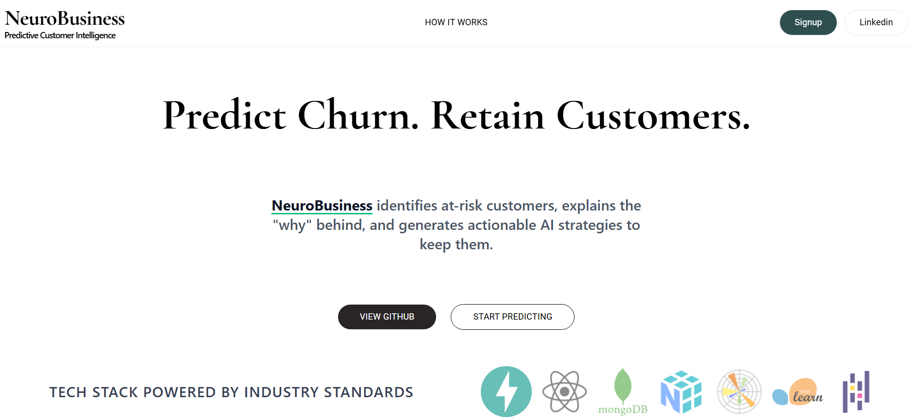

# NeuroBusiness
**Predictive Customer Intelligence & Retention Platform**

[](https://neuro-business.vercel.app/)
[](https://hub.docker.com/)

NeuroBusiness is an end-to-end B2B Machine Learning platform designed to move beyond black-box predictions. It ingests transaction data, predicts customer churn using XGBoost, explains the exact risk drivers using SHAP, and dynamically generates actionable retention strategies using Google's Gemini LLM.

## ✨ Features

* **Data Engineering Pipeline:** Automated parsing, validation, and encoding of raw CSV transaction data.
* **Predictive Analytics:** XGBoost classification model trained to identify at-risk customers with high accuracy.
* **Explainable AI (XAI):** SHAP (SHapley Additive exPlanations) integration translates mathematical probabilities into human-readable business drivers.
* **Generative AI Strategies:** Contextual prompt injection via the Gemini API to formulate customized, 3-step retention plans based on specific customer risk profiles.
* **Secure Cloud Architecture:** Full JWT-based authentication, password hashing via bcrypt, and secure MongoDB Vault integration.

## 💻 Tech Stack

**Frontend:**
* React (Vite) | Tailwind CSS | GSAP & Lenis | Recharts

**Backend:**
* FastAPI (Python) | MongoDB (Motor AsyncIO)
* XGBoost & Scikit-Learn | SHAP (TreeExplainer)
* Google GenAI API (Gemini) | Resend API 

## 📸 System Preview


---

## 🐳 Quick Start (Docker - Recommended)

The easiest way to run the entire stack locally is using Docker. You do not need Python or Node.js installed on your machine.

1. **Clone the repository:**
   ```bash
   git clone [https://github.com/yourusername/neuro-business.git](https://github.com/yourusername/neuro-business.git)
   cd neuro-business
   ```

2. **Set up Environment Variables:**
   * Copy `backend/.env.example` to `backend/.env` and fill in your MongoDB/API keys.
   * Copy `frontend/.env.example` to `frontend/.env`.

3. **Build and spin up the containers:**
   ```bash
   docker-compose up --build
   ```

4. **Access the application:**
   * **Frontend UI:** [http://localhost:5173](http://localhost:5173)
   * **Backend API Docs:** [http://localhost:8000/docs](http://localhost:8000/docs)

---

## 🛠️ Manual Local Development Setup

If you prefer to run the servers manually without Docker, follow these steps.

### Prerequisites
* Node.js (v18+)
* Python (3.10+)
* MongoDB Cluster URL

### 1. Backend Setup
```bash
cd backend
python -m venv venv
source venv/bin/activate  # On Windows use: venv\Scripts\activate
pip install -r requirements.txt
```
*Ensure your `backend/.env` is configured with `FRONTEND_URL=http://localhost:5173`*

Start the backend server:
```bash
uvicorn main:app --reload --port 8000
```

### 2. Frontend Setup
```bash
cd frontend
npm install
```
*Ensure your `frontend/.env` is configured with `VITE_API_URL=http://localhost:8000`*

Start the frontend development server:
```bash
npm run dev
```

---

## 🏗️ Architecture Overview

* **Client Layer:** User uploads CSV datasets via the React interface.
* **API Gateway:** FastAPI receives the multipart file, validates the JWT, and triggers the inference pipeline.
* **Inference Engine:** Pandas parses the data, XGBoost calculates the risk probabilities, and SHAP extracts the feature importance.
* **LLM Augmentation:** Top risk features are injected into a structured prompt for the Gemini API.
* **Storage & Delivery:** Results are persisted in MongoDB and returned to the client for interactive charting.
